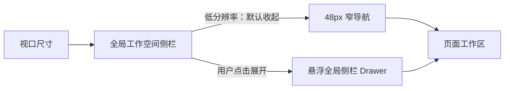
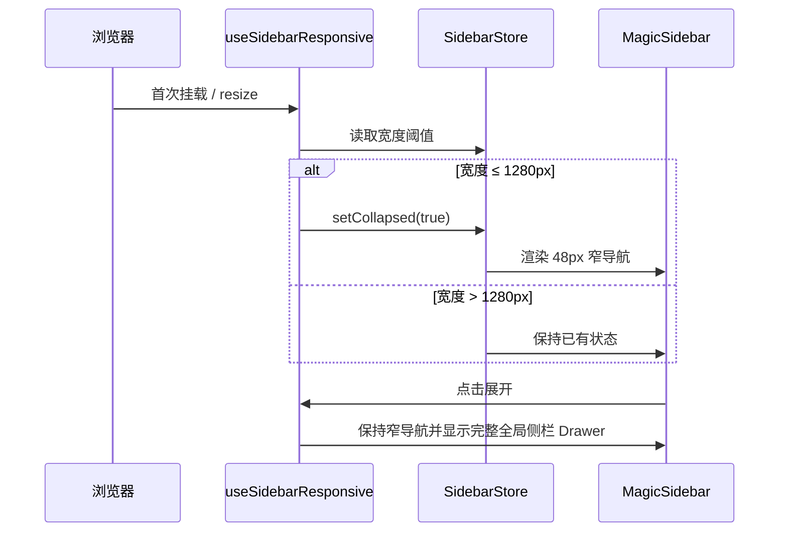

# 全局响应式布局架构（第一期：聊天工作台与工作空间侧栏）

## 1. 目标与原则

低分辨率桌面优先保证业务工作区可用；全局工作空间侧栏是第一优先级的让位区域。文件列表区、文件预览区和对话区保持各自既有的布局与交互，不因全局侧栏适配而改成 Drawer 或隐藏。



- 同一断点、同一尺寸语义只定义一次；
- 新功能使用 Tailwind 响应式 Variant；旧的 `antd-style` 继续通过 CSS Variables 消费同一批 Token；
- 自动行为只负责首次进入低分辨率和窗口缩小时的默认收起，不覆盖用户在当前页面主动展开的操作；
- 页面内部的文件、预览、对话布局由页面自身维护，不能与全局侧栏状态耦合。

## 2. 断点契约

| 名称 | 条件 | 全局侧栏行为 |
| --- | --- | --- |
| `desktop-regular` | 宽度 `> 1280px` | 沿用已保存的展开/收起状态 |
| `desktop-narrow` | 宽度 `768px–1280px` | 首次进入默认收起为窄导航，仍可手动展开 |
| `desktop-compact` | 高度 `721px–800px` | 压缩页面级高度、间距 |
| `desktop-short` | 高度 `≤ 720px` | 使用最小垂直密度 |
| `mobile` | 宽度 `< 768px` | 使用现有移动端壳层 |

宽度与高度断点独立生效。例如 `1024×768` 同时是 `desktop-narrow` 与 `desktop-compact`。

## 3. 模块、容器别名与本期范围

Token 格式固定为：

```text
--{module}-{container-alias}-{size}
```

| 模块 | 容器别名 | 组件 / 区域 | 本期适配 |
| --- | --- | --- | --- |
| `global` | `sidebar` | `BaseLayoutPc → MagicSidebar` | 低分辨率默认收起、48px 窄导航、完整全局侧栏 Drawer |
| `global` | `header` | 页面级顶部区域 | 矮屏高度压缩 Token |
| `global` | `content` | 页面内容外边距 | 矮屏 gutter / gap Token |
| `global` | `modal` | 弹窗容器 | 最大可用高度 Token |
| `chat` | `files` | `ChatSubSider` | 保留既有文件区布局，接入尺寸 Token |
| `chat` | `main` | 消息与输入区 | 保证最小可用宽度 |
| `chat` | `preview` | `ChatFilePreviewPanel` | 保留 Chat 自身的预览降级逻辑 |
| `topic` | `files` | `TopicSidebar` | **本期不改布局** |
| `topic` | `preview` | `Detail / FilesViewer` | **本期不改布局** |
| `topic` | `conversation` | `TopicMessagePanel` | **本期不改布局** |

本期只对 `global.sidebar` 做结构行为改动。Super Magic 的 TopicPage 保持原有“文件列表 + 文件预览 + 对话区”排布，预览不会转为 Drawer。

## 4. Token 清单

| Token | 默认值 | compact | short | 用途 |
| --- | ---: | ---: | ---: | --- |
| `--global-sidebar-width` | 240px | 220px | 200px | 展开状态默认宽度 |
| `--global-sidebar-min-width` | 200px | 180px | 160px | 展开状态最小宽度 |
| `--global-header-height` | 72px | 56px | 48px | 页面级 Header 高度 |
| `--global-content-gutter` | 20px | 12px | 8px | 内容边距 |
| `--global-panel-gap` | 20px | 12px | 8px | 容器间距 |
| `--global-modal-max-height` | `calc(100dvh - 64px)` | `calc(100dvh - 40px)` | `calc(100dvh - 24px)` | 弹窗最大高度 |

## 5. 运行时流程



实现入口：

- `frontend/magic-web/src/layouts/BaseLayout/hooks/useSidebarResponsive.ts`：首次挂载和缩小时自动收起；
- `frontend/magic-web/src/stores/layout/SidebarStore.ts`：收起状态、48px 窄栏宽度和持久化；
- `frontend/magic-web/src/layouts/BaseLayout/components/MagicSidebar/SidebarHeader.tsx`：展开 / 收起按钮；
- `frontend/magic-web/src/layout/styles/layout-density.css`：可供 Tailwind 与旧样式共享的 Token。

## 6. 验收视口

| 视口 | 预期 |
| --- | --- |
| 1440×900 | 工作空间侧栏保持原状态；TopicPage 文件列表、预览、对话区均保持原布局 |
| 1280×720 | 工作空间侧栏默认收起；页面进入 short 密度 |
| 1024×768 | 工作空间侧栏默认显示为 48px 窄导航；点击“Expand sidebar”后从左侧覆盖窄栏打开完整全局侧栏 Drawer，不压缩工作区 |
| 1024×768（展开后） | TopicPage 的文件列表和预览仍为原来的分栏，不显示新的预览 Drawer |

## 7. 后续迭代规则

1. 新模块先登记模块名、容器别名、适配范围和 Token，再写媒体查询；
2. 结构降级优先使用已有全局侧栏状态，避免创建平行 Store；
3. 老组件不必一次性迁移到 Tailwind，只需改为消费同一 CSS Variable；
4. 每次新增自动响应式行为，都补充“首次进入低分辨率”“手动覆盖”“恢复宽屏”三类测试。
