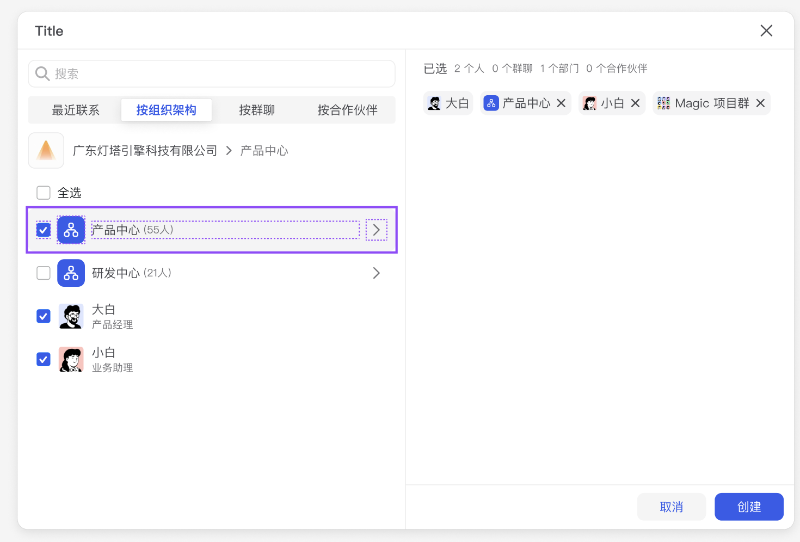

# MemberDepartmentSelector 组件

## 简介

MemberDepartmentSelector 是一个基于 `@feb/user-selector` 的成员和部门选择器组件。它提供了组织架构树形选择、成员搜索、多选、权限管理等功能，支持将选中的部门自动转换为该部门下的所有成员。

## 特性

- 支持组织架构树形展示
- 支持成员搜索功能
- 支持多选
- 支持部门转换为成员
- 支持面包屑导航
- 支持分页加载
- 支持防抖搜索
- 支持国际化
- 权限管理

## 使用方式

```tsx
import MemberDepartmentSelector from '@/components/business/MemberDepartmentSelector'

// 基本使用
<MemberDepartmentSelector
  isConvertToUser={false}
  onOk={(selected) => {
    console.log('选中的节点:', selected)
  }}
  onCancel={() => {
    console.log('取消选择')
  }}
/>
```

## Props

| 属性 | 类型 | 默认值 | 说明 |
|------|------|--------|------|
| isConvertToUser | `boolean` | `false` | 是否将选中的部门转换为该部门下的所有成员 |
| onOk | `(selected: TreeNode[]) => void` | - | 确定回调，返回选中的节点数组 |
| onCancel | `() => void` | - | 取消回调 |
| ...其他属性 | `UserSelectorProps` | - | 继承自 `@feb/user-selector` 的 UserSelectorProps |

## 数据结构

### TreeNode 类型
```typescript
interface TreeNode {
  id: string
  name: string
  dataType: NodeType
  // ...其他属性
}
```

### NodeType 枚举
```typescript
enum NodeType {
  Department = 'department',
  User = 'user'
}
```

## 依赖

- @feb/user-selector
- ahooks
- swr
- lodash
- react
- antd

## 注意事项

1. 组件使用了 `memo` 进行性能优化
2. 搜索功能使用了 800ms 的防抖处理
3. 支持分页加载搜索结果
4. 部门转换为成员时会自动去重
5. 组件内部维护了搜索状态和选中路径状态

## 性能优化

1. 使用 `useMemoizedFn` 优化回调函数
2. 使用 `useDebounce` 优化搜索请求
3. 使用 `useMemo` 优化数据转换

## UI图



