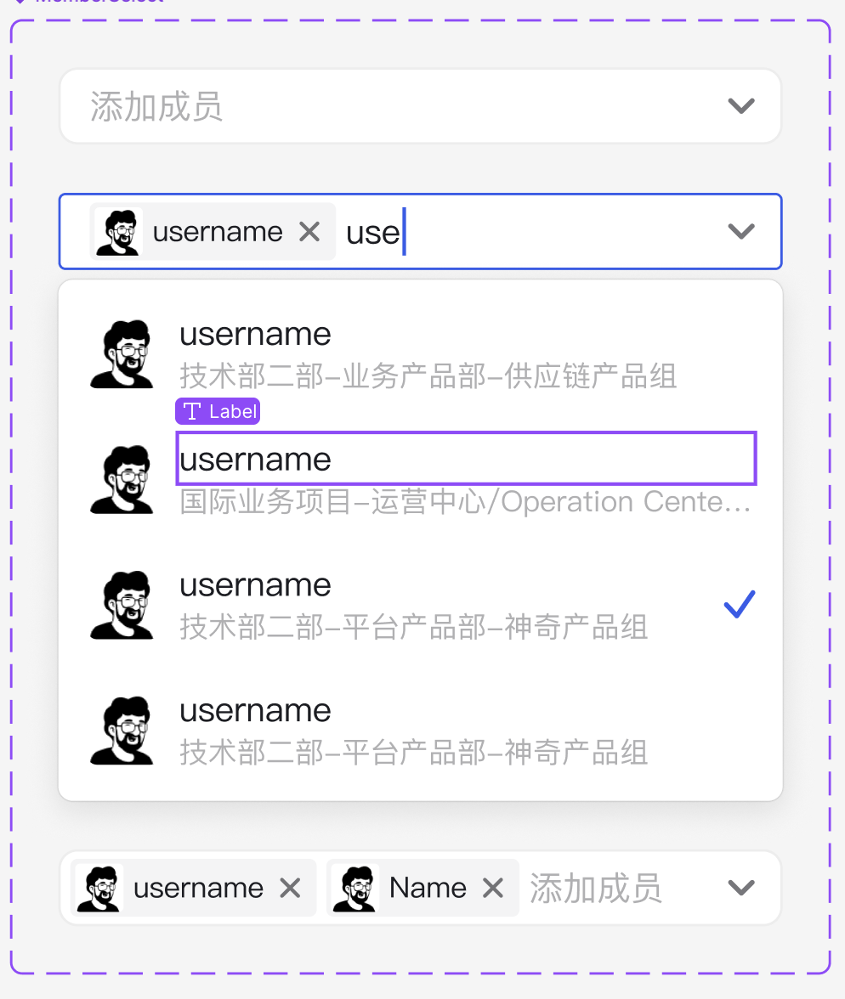

# UserSelect 组件

`UserSelect` 是一个用于选择用户或部门的多选组件，支持 Magic 和 Teamshare 两种数据源。该组件集成了自定义标签渲染、头像展示、部门图标等功能，适用于需要成员/部门选择的场景。

## 功能特点

- 支持从 Magic 或 Teamshare 数据源选择成员或部门
- 选中项以标签形式展示，支持头像和部门图标
- 可自定义成员选择器属性
- 选中项支持删除
- 适配 antd v5 及相关生态

## 使用方法

### 基本用法

```tsx
import UserSelect from "components/UserSelect"
import { useState } from "react"

const Demo = () => {
  const [selected, setSelected] = useState([])

  return (
    <UserSelect
      selected={selected}
      setSelected={setSelected}
      // 可选：数据源，默认为 "Magic"
      dataSource="Magic"
      // 可选：成员选择器属性
      departmentSelectorProps={{}}
      // 其他 MagicSelect 支持的属性
      placeholder="请选择成员"
    />
  )
}
```

## Props

| 属性                      | 说明                         | 类型                                                                 | 默认值     |
|---------------------------|------------------------------|----------------------------------------------------------------------|------------|
| `selected`                | 当前选中的成员/部门          | `TreeNode[]`                                                         | -          |
| `setSelected`             | 设置选中的成员/部门          | `(selected: TreeNode[]) => void`                                     | -          |
| `dataSource`              | 数据源类型                   | `"Magic"` \| `"Teamshare"`                                           | `"Magic"`  |
| `departmentSelectorProps` | 成员选择器的额外属性         | `MemberDepartmentSelectorProps` \| `TsMemberDepartmentSelectorProps`  | -          |
| 其他                      | 继承自 `MagicSelectProps`    | -                                                                    | -          |

## 依赖

- [antd](https://ant.design/)
- [ahooks](https://ahooks.js.org/)
- [@feb/user-selector](https://github.com/feb-team/user-selector)
- [@tabler/icons-react](https://tabler.io/icons)
- 组件库内部的 `MagicSelect`、`MagicAvatar`、`MemberDepartmentSelector`、`TsMemberDepartmentSelector`、`useAdmin` 等

## 说明

- 选中项会以标签形式展示，用户可以点击标签上的关闭按钮移除选中项。
- 点击输入框会弹出成员/部门选择器，确认后自动关闭弹窗并更新选中项。
- 支持自定义成员选择器的属性（如过滤、限制等）。

## 示例

### 切换数据源

```tsx
<UserSelect
  selected={selected}
  setSelected={setSelected}
  dataSource="Teamshare"
/>
```

### 自定义成员选择器属性

```tsx
<UserSelect
  selected={selected}
  setSelected={setSelected}
  departmentSelectorProps={{
    // 例如：只允许选择用户
    onlyUser: true,
  }}
/>
```

---

如需更多高级用法，请参考源码或联系组件维护者。

## 样式

- 选择器最小宽度：260px
- 选择器宽度：100%
- 标签字体大小：14px
- 描述文字大小：12px
- 标签背景色：使用主题色
- 标签圆角：4px
- 头像大小：30px（选项）/ 18px（标签）

## 国际化配置

需要在国际化文件中配置以下键值：

```json
{
  "aiModel": {
    "functionConfig": {
      "addMember": "添加成员"
    }
  }
}
```

## UI图


