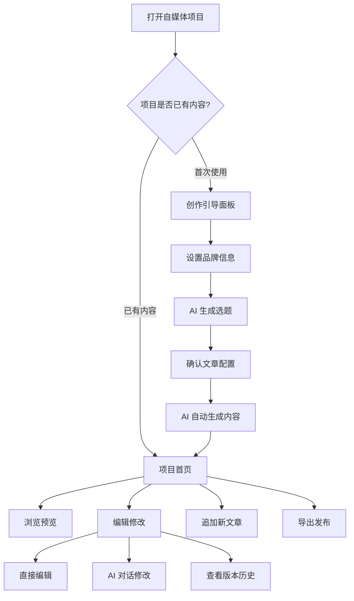

# 自媒体内容创作系统 — 产品功能文档

## 一、产品是什么

**一句话定位**：AI 帮你做社交媒体图文内容，从想选题到出图，全程自动化。

这是一个嵌入在「超级麦吉（Super Magic）」工作区中的 AI 自媒体创作工具。你只需要告诉 AI 你的品牌是做什么的，它就能帮你：

1. **想选题** — 根据品牌定位自动生成多个内容方向
2. **写内容** — 按选题自动生成图文卡片或长文
3. **出效果** — 在手机壳里 1:1 预览各平台的真实发布效果
4. **改到满意** — 直接编辑或用对话让 AI 帮你改
5. **一键导出** — 打包高清图片 ZIP，直接拿去发布

### 核心优势

- **一次创作，多平台发布**：同一组内容自动适配小红书、Instagram、微信公众号的排版和格式
- **全程 AI 辅助**：从选题灵感到内容生成再到修改迭代，AI 全程参与
- **所见即所得**：手机壳仿真预览，看到的就是发布后的效果
- **批量高效**：一口气规划多篇文章，并行生成，效率翻倍
- **随时可改**：生成不满意？在线编辑、AI 对话修改、版本回溯，改到满意为止

---

## 二、支持的平台

| 平台        | 状态      | 内容形式               | 预览效果            |
| ----------- | --------- | ---------------------- | ------------------- |
| 小红书      | ✅ 可用   | 图文卡片（6-9 张滑动） | 九宫格 + 手机壳详情 |
| Instagram   | ✅ 可用   | 图文卡片（轮播帖）     | 网格 + 手机壳 Reel  |
| 微信公众号  | ✅ 可用   | 长文 + 封面图          | 订阅号消息 + 全文   |
| TikTok      | 🔜 规划中 | —                      | —                   |
| X (Twitter) | 🔜 规划中 | —                      | —                   |
| Facebook    | 🔜 规划中 | —                      | —                   |
| 微信视频号  | 🔜 规划中 | —                      | —                   |

---

## 三、完整使用流程



---

## 四、功能详述

### 4.1 首次创作引导

当你第一次进入自媒体项目时，系统会自动进入引导流程，分三步完成从零到内容生成的全过程。

#### 第一步：设置品牌信息

告诉 AI 你是谁、做什么的，这些信息会贯穿后续所有内容生成环节。

| 需要填写 | 是否必填 | 说明                                          |
| -------- | -------- | --------------------------------------------- |
| 账号名称 | ✅ 必填  | 你的品牌名/IP 名，会出现在预览的作者位        |
| 品牌定位 | ✅ 必填  | 一句话说清楚你是做什么的，AI 据此把控内容调性 |
| 目标受众 | 选填     | 你想给谁看？有助于 AI 调整内容风格            |
| 品牌素材 | 选填     | 品牌 logo、IP 形象等图片素材，可附描述        |

**省心小技巧**：

- 输入平台账号名，AI 会自动去抓取你的公开信息帮你填好
- 品牌信息会自动保存为草稿，下次打开无需重新填写
- 后续可随时通过「品牌配置」按钮修改

#### 第二步：AI 生成选题

基于你的品牌信息，AI 自动生成多个选题建议。

**你可以做的事**：

- 输入创作方向/关键词，引导 AI 的选题方向（可选）
- 上传参考资料（如竞品截图、行业报告），让 AI 有更多灵感
- 设置生成数量（默认 5 个选题）
- 选择 AI 模型

**AI 会给你什么**：

每个选题已包含完整的创作方案：

- 标题与内容摘要
- 推荐平台（小红书 / Instagram / 微信公众号）
- 内容风格（专业 / 轻松 / 叙事 / 教程 / 情感）
- 视觉模板预设
- 建议卡片张数
- 大纲结构

**操作方式**：

- 逐条采纳或删除 AI 生成的选题
- 也可以手动新增自己想到的选题
- 采纳的选题进入下一步详细配置

#### 第三步：确认文章配置

对每篇文章进行最后的调整和确认。

| 可配置项 | 说明                                                                 |
| -------- | -------------------------------------------------------------------- |
| 标题     | 从选题继承，可修改                                                   |
| 目标平台 | 小红书 / Instagram / 微信公众号                                      |
| 内容风格 | 专业 / 轻松 / 叙事 / 教程 / 情感 / 自定义                            |
| 视觉模板 | 新拟态 / 代码风 / 暗黑科技 / 渐变编辑 / 个人洞见 / ins 现代 / 自定义 |
| 卡片数量 | 6-9 张（卡片类平台适用）                                             |
| 大纲     | 树形结构，支持 AI 生成/AI 优化/手动编辑                              |
| 参考素材 | 可附加图片、文件，每个素材可写描述                                   |
| 参考文件 | 可从项目文件树中选择已有文件作为参考                                 |
| 补充说明 | 额外的创作要求                                                       |

**大纲编辑**：

- 支持多层级树形结构，自由嵌套
- 一键让 AI 根据标题 + 风格自动生成大纲
- 用自然语言告诉 AI 怎么调整（如"第三点展开讲详细一点"）
- 每个大纲要点可以绑定参考素材图

**视觉模板预设**：

| 模板名   | 适用平台  | 风格特点                |
| -------- | --------- | ----------------------- |
| 新拟态   | 小红书    | 大胆配色、卡片感强      |
| 代码风   | 小红书    | 暗色终端风、技术范      |
| 暗黑科技 | 小红书    | 黑金配色、科技质感      |
| 渐变编辑 | 小红书    | 紫色渐变、优雅编辑风    |
| 个人洞见 | 小红书    | 白底蓝字、清爽干练      |
| ins 现代 | Instagram | 白色极简、现代感        |
| 自定义   | 全平台    | 上传参考图，AI 模仿风格 |
| 不指定   | 全平台    | 由 AI 自由发挥          |

确认完毕后点击「发送」，系统自动：

1. 为每篇文章创建独立的 AI 对话
2. 上传绑定的素材到对应目录
3. 将品牌信息 + 文章配置 + 大纲打包成指令发送给 AI
4. AI 在后台自动生成所有卡片/文章内容

---

### 4.2 项目首页

当项目已有内容时，进入的是首页概览界面。

**你能看到**：

- **AI 卡片区**：通过独立 AI 任务创建的卡片文件夹，点击可进入查看
- **文章区**：按平台分组展示所有已生成的文章，每篇显示首张卡片缩略图
- **品牌配置入口**：随时查看和修改品牌信息
- **创建新文章按钮**：在已有内容基础上追加新文章

**快捷操作**：

- 点击任意文章卡片，直接进入该文章的预览详情
- 点击 AI 卡片文件夹，进入对应的 AI 创作对话
- 空态时显示引导提示，帮助你快速上手

---

### 4.3 多平台仿真预览

进入具体文章后，系统会在高度还原的平台 UI 壳子中展示内容效果。

#### 小红书预览

| 视图   | 效果说明                                                        |
| ------ | --------------------------------------------------------------- |
| Feed   | 九宫格瀑布流，展示所有文章的首图缩略图 + 标题 + 点赞数          |
| Detail | 手机壳内轮播卡片，顶部作者栏 + 底部标题标签评论区，支持左右滑动 |
| Scroll | 所有卡片纵向无缝拼接成长图，适合全览或长图导出                  |
| Edit   | 左侧缩略图列表 + 中间编辑区，支持拖拽排序、实时预览             |

#### Instagram 预览

| 视图   | 效果说明                                  |
| ------ | ----------------------------------------- |
| Feed   | 3 列网格，还原 Instagram 个人主页风格     |
| Detail | 手机壳内展示，顶部 Stories 栏 + 轮播卡片  |
| Edit   | 缩略图列表 + 编辑区，与小红书编辑体验一致 |

#### 微信公众号预览

| 视图 | 效果说明                                                   |
| ---- | ---------------------------------------------------------- |
| 封面 | 手机壳内还原「订阅号消息」列表：品牌头像 + 大图封面 + 标题 |
| 全文 | 渲染完整长文 HTML，所见即所得                              |
| 编辑 | 在线编辑文章 HTML 源码，实时预览                           |
| 源码 | 只读查看 HTML 源码                                         |

**通用交互**：

- **平台切换**：项目包含多个平台内容时，顶部显示切换器，一键切换
- **文章切换**：下拉菜单列出当前平台的所有文章，快速跳转
- **视图切换**：Tab 栏切换不同视图模式
- **键盘快捷键**：← → 切换卡片，触摸设备支持滑动手势
- **文件树联动**：在文件树中点击某个文件，自动跳转到对应的预览位置

---

### 4.4 内容编辑与 AI 修改

#### 在线编辑

进入 Edit 视图后可以直接修改内容：

- 左侧缩略图列表，点击切换到要编辑的卡片
- 中间编辑区实时预览改动效果
- 自动保存 + 手动保存，右上角显示保存状态（已保存 / 保存中 / 未保存）
- 切换文章或视图时，如果有未保存的修改会弹窗确认

#### AI 对话修改

不想手动改代码？用自然语言告诉 AI 你想怎么改：

- 通过卡片右侧操作条或右键菜单，选择「加到当前聊天」
- AI 会自动引用当前卡片文件
- 用自然语言描述修改意图（如"把标题颜色改成蓝色"、"第二段文字太长了缩短一些"）
- AI 直接修改文件，预览区自动刷新

#### 版本历史与回溯

每次内容被修改后，系统自动记录版本历史：

- 点击卡片操作条上的「版本历史」按钮，查看历史版本列表（最多 10 个版本）
- 版本对比弹窗：左侧当前版本，右侧历史版本，一目了然
- 可以随时回退到任意历史版本

#### 卡片右键菜单

对任意一张卡片右键，快捷执行：

- 加到当前聊天（让 AI 帮改）
- 新建聊天讨论此卡片
- 刷新预览
- 跳转到编辑视图

#### 卡片操作条

每张卡片右侧悬浮操作条：

- 📎 加到当前聊天
- 📁 加整篇文章到聊天
- 🔄 刷新卡片
- ✏️ 去编辑
- 🕐 版本历史

（只读模式下仅显示刷新按钮）

---

### 4.5 内容检查器

类似浏览器开发者工具的「检查元素」功能：

- 开启后，鼠标悬停在卡片上会高亮对应的内容区块
- 点击选中元素后，自动将元素信息追加到消息编辑器
- 支持跨卡片检查，方便精确告诉 AI 你要修改哪个部分
- 适合需要精准定位修改区域的场景

---

### 4.6 AI 卡片独立创建

除了通过引导流程批量创建外，还可以单独发起 AI 卡片创建任务：

- 从首页点击「AI 卡片」创建按钮
- 填写任务名称和分析指令
- 选择 AI 模型（语言模型 / 图片模型 / 视频模型），系统会记住你的选择
- 可选择内容模板
- 支持设置定时任务（让 AI 定期自动生成内容）
- 创建后自动跳转到新任务的对话页面

---

### 4.7 导出发布

#### 批量导出

1. 点击导出按钮，弹出导出预览弹窗
2. 预览所有待导出卡片的缩略图网格
3. 选择导出分辨率（2x / 3x 高清）
4. 设置 ZIP 文件名
5. 点击确认，系统逐张截图并打包下载

**导出过程**：

- 实时显示进度（已完成 / 总数）
- 每张卡片截图最长等待 20 秒
- 完成后自动下载 ZIP 文件
- ZIP 内按文章分文件夹，卡片按序号命名（如 `01_卡片名.png`）

#### 单张导出

通过右键菜单可以单独导出任意一张卡片为 PNG 图片。

---

### 4.8 品牌配置管理

品牌信息是全局共享的，影响所有 AI 生成的内容调性：

- 首页提供「品牌配置」快捷入口
- 支持随时修改账号名称、品牌定位、目标受众、品牌素材
- 修改后的信息会应用到后续新建的所有文章
- 自动保存草稿，无需担心丢失

---

### 4.9 追加新文章

项目已有内容后，随时可以追加新文章：

- 首页或预览页顶部点击「创建文章」
- 进入与首次创作相同的引导流程（品牌信息已自动填入）
- 新生成的内容追加到现有项目中
- 预览区自动更新展示新内容

---

## 五、用户体验细节

### 5.1 智能加载

- 进入项目只加载必要数据，不会一次性加载所有内容
- 切换文章时已看过的内容秒切，新内容显示加载动画
- 导出时自动加载全部内容，确保完整性

### 5.2 草稿与自动保存

- 创作引导面板的所有填写内容自动保存为草稿
- 下次打开自动恢复，不怕中途关闭
- 品牌配置修改实时保存

### 5.3 编辑保护

- 切换文章/视图时，如有未保存的编辑会弹窗提醒
- 避免误操作导致编辑内容丢失
- 保存状态实时可见

### 5.4 权限适配

- 只读模式（如无编辑权限）时自动隐藏编辑相关功能
- 操作条、菜单项智能调整，不显示无法执行的操作

### 5.5 国际化

- 界面支持中文/英文切换
- AI 生成内容根据语言设置自动调整提示词语言

### 5.6 平台兼容

- 支持 Chrome / Edge / Safari 等现代浏览器
- 卡片内容在隔离环境中安全渲染，不会与主界面互相干扰

---

## 六、典型使用场景

### 场景一：品牌首次批量创作

> 我是一个品牌运营，想快速产出一批小红书图文内容。

**操作路径**：设置品牌信息 → AI 生成 5 个选题 → 选 3 个感兴趣的 → 确认配置后一键生成 → 在手机壳里预览效果 → 导出 ZIP 发布

### 场景二：多平台同步发布

> 同一个内容想同时发小红书和 Instagram。

**操作路径**：在选题配置中分别为同一主题创建小红书版和 Instagram 版 → 平台切换器一键对比两个版本 → 分别导出

### 场景三：AI 辅助精修

> AI 生成的第 3 张卡片配色不太对，想调整。

**操作路径**：右键卡片 → 「加到当前聊天」→ 输入"把背景色换成深蓝色渐变" → AI 自动修改 → 预览实时刷新

### 场景四：持续更新

> 项目已经有 5 篇文章了，想再追加 3 篇新内容。

**操作路径**：首页点击「创建文章」→ 品牌信息已自动填入 → 重新走选题和配置流程 → 新内容自动追加到项目中

### 场景五：版本回退

> 让 AI 改了好几版，发现第一版其实最好。

**操作路径**：点击版本历史 → 选择第一版 → 对比确认 → 回退到该版本

---

## 七、数据结构概览

### 7.1 项目目录

```
自媒体项目/
├── magic.project.js     ← 项目总索引（哪些平台、哪些文章）
├── posts/
│   ├── 选题A/
│   │   ├── post.json    ← 文章元信息 + 卡片列表
│   │   ├── cards/       ← 各张卡片 HTML 文件
│   │   └── assets/      ← 文章素材（图片等）
│   └── 选题B/
│       └── ...
└── shared/              ← 多文章共用资源
```

### 7.2 加载机制

| 时机         | 加载内容         | 用户感知                 |
| ------------ | ---------------- | ------------------------ |
| 进入项目     | 项目总索引       | 看到平台切换器和文章列表 |
| 点击某篇文章 | 该文章的完整数据 | 看到卡片内容开始渲染     |
| 点击导出     | 所有文章数据     | 进度条显示加载中         |

### 7.3 实时同步

- 当 AI 在后台生成新文件时，系统会自动检测到变更并更新预览
- 无需手动刷新，内容生成完毕即可查看

---

## 八、约束与限制

1. 每篇文章的配置文件名固定为 `post.json`
2. 卡片/文章/封面等路径均相对于文章自身目录
3. 文章中引用的所有图片、素材必须存在于项目文件树中才能正常显示
4. 小红书和 Instagram 使用卡片格式，微信公众号使用长文格式，两种格式互不通用
5. 版本历史最多保留 10 个版本
6. 单张卡片导出截图最长等待 20 秒
7. 当前支持中文和英文两种界面语言
