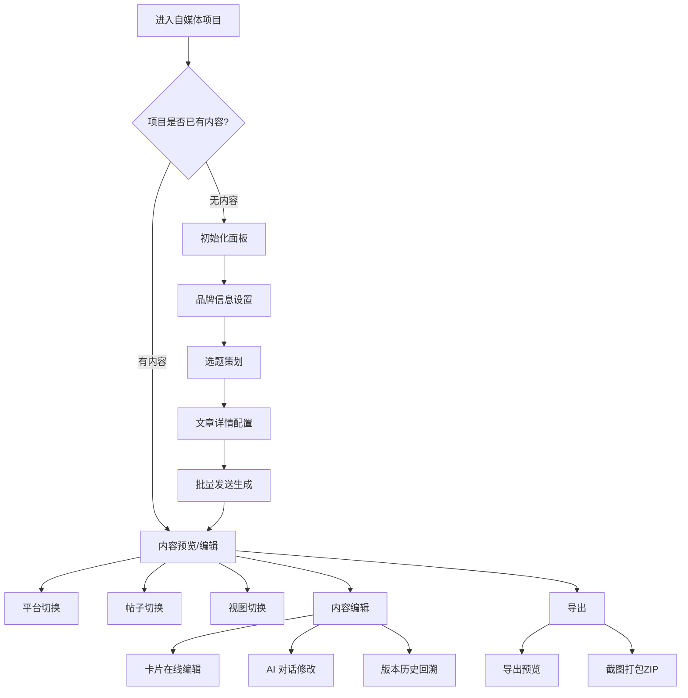
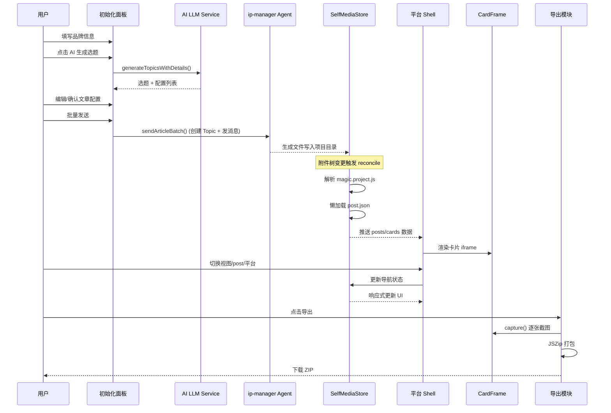

# 自媒体内容创作系统 — 功能需求文档

## 一、产品概述

### 1.1 产品定位

本系统是一个 **AI 驱动的多平台自媒体内容创作与预览工具**，嵌入在「超级麦吉（Super Magic）」项目工作区中。用户可以从零开始策划选题、规划大纲、通过 AI Agent 自动生成图文卡片内容，并在多平台仿真壳子中预览最终效果，最终导出为可发布的图片素材包。

### 1.2 核心价值

| 价值维度      | 说明                                                        |
| ------------- | ----------------------------------------------------------- |
| 多平台适配    | 一次创作，同步输出小红书、Instagram、微信公众号等多平台格式 |
| AI 全流程辅助 | 选题生成 → 大纲规划 → 内容生成 → 卡片渲染，全程 AI 参与     |
| 所见即所得    | 手机壳仿真预览，1:1 还原各平台真实展示效果                  |
| 批量高效      | 一次规划多篇文章，批量创建任务并行生成                      |
| 可编辑可迭代  | 生成后支持在线编辑、版本对比、AI 对话修改                   |

---

## 二、完整创作流程



---

## 三、功能模块详述

### 3.1 项目初始化模块（SelfMediaInitPanel）

当自媒体项目目录为空（无 `magic.project.js` 根配置）时，系统进入初始化面板，引导用户完成从零到内容生成的全流程配置。

#### 3.1.1 品牌信息设置（Global Settings）

**功能描述**：收集账号/品牌的基础信息，作为后续所有 AI 生成的上下文。

| 字段                       | 类型     | 必填 | 说明                                |
| -------------------------- | -------- | ---- | ----------------------------------- |
| 账号名称（author）         | 文本     | 是   | 品牌/IP 的对外名称                  |
| 品牌定位（brandPosition）  | 文本     | 是   | 一句话描述品牌的核心定位            |
| 目标受众（targetAudience） | 文本     | 否   | 目标用户画像                        |
| 品牌素材（brandImages）    | 文件列表 | 否   | 品牌 logo/IP 形象等视觉素材，附描述 |

**AI 辅助**：

- 支持通过输入平台账号名称，AI 自动抓取并填充品牌信息（通过 `selfMediaAccountFetch` 服务调用 ip-manager Agent）。

#### 3.1.2 AI 选题策划（Topic Generation）

**功能描述**：基于品牌信息，AI 自动生成多个内容选题建议。

**输入参数**：

- 品牌信息（自动注入）
- 创作方向/关键词（可选）
- 参考资料文本（可选，来自用户上传的文件）
- 生成数量（默认 5 个）
- 模型选择

**输出结果**：

```json
[
	{
		"cardCount": 7,
		"description": "一句话内容方向摘要",
		"outline": "- 要点1\n  - 子要点\n- 要点2",
		"platform": "rednote",
		"style": "professional",
		"title": "选题标题",
		"visualPreset": "neo-brutalism"
	}
]
```

**交互流程**：

1. 用户填写创作方向（可选）→ 点击「AI 生成选题」
2. AI 返回选题列表，每个选题已包含平台、风格、视觉模板、卡片数、大纲的预配置
3. 用户可逐条采纳/删除选题，也可手动新增选题
4. 采纳的选题进入文章详情列表

#### 3.1.3 文章详情配置（Article Detail）

**功能描述**：对每篇文章进行精细化配置。

| 配置项               | 说明                                            |
| -------------------- | ----------------------------------------------- |
| 标题                 | 文章标题（从选题继承，可修改）                  |
| 目录名（folderName） | 可选，留空自动生成，用于文件系统目录名          |
| 平台                 | 小红书 / Instagram / 微信公众号 等              |
| 内容风格             | 专业 / 轻松 / 叙事 / 教程 / 情感 / 自定义       |
| 视觉模板             | 新拟态 / 代码风 / 暗黑科技 / ins 现代 / 自定义  |
| 卡片数量             | 卡片流平台的卡片张数（6-9），微信公众号无此字段 |
| 大纲编辑器           | 树形大纲结构，支持 AI 生成/优化/手动编辑        |
| 参考素材             | 可附加图片/文件素材，每个素材可绑定描述         |
| 参考文件             | 可从项目文件树选择已有文件作为参考              |
| 补充说明             | 额外的创作指令/约束                             |

**大纲编辑器功能**：

- 树形层级结构（OutlineNode[]），支持任意嵌套
- AI 一键生成大纲（基于标题+风格+平台）
- AI 优化大纲（基于用户自然语言修改指令）
- 手动增删改节点
- 每个大纲节点可绑定参考素材

#### 3.1.4 批量任务发送（Batch Send）

**功能描述**：将所有配置好的文章以任务形式批量发送给 AI Agent 执行内容生成。

**执行流程**：

1. 为每篇文章创建独立的 Topic（会话）
2. 上传绑定的素材文件到对应目录
3. 构建结构化 Prompt（包含品牌信息、文章配置、大纲、素材引用、目标目录 @mention）
4. 通过 `ip-manager` Agent Pattern 发送消息
5. Agent 在沙箱中自动生成 HTML 卡片/文章

**Prompt 构建规则**（selfMediaPromptBuilder）：

- 使用 TipTap JSON 格式构建富文本消息
- 通过 @mention 引用目标输出目录和素材文件
- 包含品牌信息、平台要求、风格指导、视觉模板描述、大纲内容
- 支持自定义视觉模板时附加参考图片

---

### 3.2 数据层与项目结构

#### 3.2.1 项目目录规范

```
self-media-root/
├── magic.project.js        ← 根索引（平台 + post 入口列表）
├── posts/
│   ├── ai-bill/
│   │   ├── post.json       ← post 清单（meta + cards/article）
│   │   ├── cards/
│   │   │   ├── 01.html
│   │   │   └── 02.html
│   │   └── assets/
│   └── ...
└── shared/                 ← 多 post 共享资源
```

#### 3.2.2 根索引（magic.project.js）

```javascript
window.magicProjectConfig = {
	type: "self-media",
	"self-media": {
		rednote: {
			posts: [{ id: "ai-bill", name: "AI 账单拆解", entry: "posts/ai-bill/post.json" }],
		},
		"wechat-official-accounts": {
			posts: [
				{ id: "ppt-launch", name: "PPT 导出上线", entry: "posts/ppt-launch/post.json" },
			],
		},
	},
}
```

**设计约束**：

- 只存储平台声明 + post 入口索引
- 不内联 post 的完整内容
- 保持文件轻量

#### 3.2.3 Post 清单（post.json）

**卡片流平台**（小红书/Instagram）：

```json
{
	"cards": ["cards/01.html", "cards/02.html"],
	"id": "ai-bill",
	"meta": {
		"author": "@magic",
		"commentCount": "128",
		"comments": [{ "name": "Alice", "text": "这个结构很清晰" }],
		"feedLikes": "1.8w",
		"feedTitle": "AI 账单拆解，一次讲清楚",
		"id": "ai-bill",
		"subtitle": "成本、结构与优化建议",
		"tags": "#AI #Billing",
		"title": "AI 账单拆解"
	}
}
```

**微信公众号**：

```json
{
	"article": "正文.html",
	"heroCover": "assets/cover-hero.jpg",
	"id": "ppt-launch",
	"meta": { "author": "@超级麦吉", "time": "4 分钟前", "title": "PPT 导出上线" },
	"thumbnailCover": "assets/cover-square.jpg"
}
```

#### 3.2.4 运行时加载模型

| 层级    | 时机        | 加载内容         | 用户可见效果               |
| ------- | ----------- | ---------------- | -------------------------- |
| 第 1 层 | 进入项目    | magic.project.js | 渲染平台壳子 + post 切换器 |
| 第 2 层 | 激活某 post | 对应 post.json   | 渲染卡片内容               |

**加载策略**：

- 首次只加载当前激活 post
- 切换 post 时懒加载
- 已加载过的 post 缓存在内存中
- 导出前调用 `ensureAllPostsLoaded()` 全量加载

---

### 3.3 多平台预览模块

#### 3.3.1 平台注册机制

系统通过 `platformRegistry` 懒加载注册平台组件：

| 平台 ID                    | 显示名      | 状态   |
| -------------------------- | ----------- | ------ |
| `rednote`                  | 小红书      | 已实现 |
| `instagram`                | Instagram   | 已实现 |
| `wechat-official-accounts` | 微信公众号  | 已实现 |
| `tiktok`                   | TikTok      | 待开发 |
| `x`                        | X (Twitter) | 待开发 |
| `facebook`                 | Facebook    | 待开发 |
| `wechat-channels`          | 微信视频号  | 待开发 |

**扩展方式**：新建 `platforms/<id>/Shell.tsx` + `tokens.ts` + 注册到 `platformRegistry`。

#### 3.3.2 平台视图矩阵

| 平台       | Feed 视图         | Detail 视图     | Scroll 视图 | Edit 视图   | Code 视图 |
| ---------- | ----------------- | --------------- | ----------- | ----------- | --------- |
| 小红书     | ✅ 九宫格瀑布流   | ✅ 手机壳详情页 | ✅ 长图滚动 | ✅ 卡片编辑 | -         |
| Instagram  | ✅ 网格 Feed      | ✅ 手机壳 Reel  | -           | ✅ 卡片编辑 | -         |
| 微信公众号 | ✅ 订阅号消息封面 | ✅ 文章全文     | -           | ✅ 文章编辑 | ✅ 源码   |

#### 3.3.3 小红书预览（RednoteShell）

**Feed 视图**：

- 瀑布流布局，展示所有 post 的第一张卡片缩略图
- 显示 feedTitle + feedLikes
- 点击进入 Detail

**Detail 视图**：

- 手机壳（393×852）内展示
- 顶部作者栏（头像 + 名称 + 关注按钮）
- 卡片轮播（左右滑动，dot 指示器）
- 底部互动区（标题 + 标签 + 评论）
- 支持键盘 ← → 切换卡片

**Scroll 视图**：

- 所有卡片纵向无缝拼接
- 适用于长图导出场景

**Edit 视图**：

- 左侧缩略图侧边栏（可拖拽排序）
- 中间 iframe 编辑区
- 支持代码编辑 + 实时预览
- 保存状态指示器（已保存/保存中/未保存）
- 刷新确认对话框（防止误操作丢失）

#### 3.3.4 Instagram 预览（InstagramShell）

- Feed 视图：3 列网格
- Detail 视图：手机壳（393×852）+ 顶部 Stories 栏 + 轮播
- Edit 视图：类似 Rednote

#### 3.3.5 微信公众号预览（WechatOfficialShell）

**Feed（封面）视图**：

- 手机壳内还原「订阅号消息」列表样式
- 绿色品牌头像 + 作者名 + 时间
- heroCover 大图（16:9）+ 底部渐变标题
- thumbnailCover 小图副卡

**Detail 视图**：

- 无壳全宽，直接渲染 article HTML 长文

**Edit 视图**：

- 在线编辑 article 的 HTML 源码

**Code 视图**：

- 只读源码查看

---

### 3.4 卡片渲染模块（CardFrame）

#### 3.4.1 渲染流程

```
fileId → 获取下载 URL → 拉取 HTML 文本 → processHtmlContent() 预处理 → iframe srcDoc 渲染
```

**HTML 预处理（processHtmlContent）**：

- 修正相对资源路径（图片、CSS、JS）为绝对 URL
- 确保资源可在 iframe 内正常加载

#### 3.4.2 卡片截图（capture）

```
1. 读取 iframe 实际内容尺寸
2. Font Awesome 图标 → 内联 SVG 临时替换
3. snapdom 截取 iframe body → PNG
4. 恢复原始 DOM
5. 失败时回退到 html-to-image.toPng()
```

#### 3.4.3 版本管理

- **CardVersionHistoryButton**：展示卡片的历史版本列表
- **CardVersionCompareDialog**：双栏对比当前版本与历史版本的视觉差异
- 通过 `version` token（来自 `updated_at`）标识版本变更

---

### 3.5 内容编辑模块

#### 3.5.1 在线编辑（Edit View）

- iframe 内直接编辑 HTML 源码
- 实时预览变更效果
- 自动保存 + 手动保存
- 保存状态指示器（RednoteEditSaveStatusIndicator）

#### 3.5.2 AI 对话式修改（Card Chat）

- 通过 `selfMediaCardChat` 服务
- 将当前卡片文件以 @mention 形式引用
- 用户用自然语言描述修改意图
- AI Agent 直接修改文件内容
- 修改后 CardFrame 检测 `version` 变化自动刷新

#### 3.5.3 右键上下文菜单（SelfMediaCardContextMenu）

对单张卡片提供快捷操作：

- 在新 Tab 中查看
- AI 修改此卡片
- 查看源码
- 导出此卡片

---

### 3.6 导出模块

#### 3.6.1 导出预览（ExportPreviewDialog）

- 弹窗展示所有待导出卡片的缩略图网格
- 可选择包含/排除某些卡片
- 设置导出分辨率（pixelRatio）
- 设置 ZIP 文件名

#### 3.6.2 ZIP 打包导出（useExportZip）

**流程**：

1. 确保所有 post 已完整加载（`ensureAllPostsLoaded()`）
2. 逐张卡片调用 `CardFrame.capture()` 截图
3. 截图超时保护（20 秒/张）
4. 按 post 分文件夹，卡片按序号命名：`01_cardName.png`
5. 使用 JSZip 打包 + FileSaver 下载

**进度反馈**：

- 实时进度条：`current / total`
- 状态：idle → running → done / error
- Toast 通知最终结果

#### 3.6.3 单张卡片导出

- 右键菜单 → 「导出此卡片」
- 直接保存单张 PNG

---

### 3.7 导航与交互模块

#### 3.7.1 平台切换器（PlatformSwitcher）

- 多平台项目顶部显示切换器
- 单平台时自动隐藏
- Portal 到 Shell 头部区域

#### 3.7.2 帖子选择器（PostSelector）

- 下拉菜单列出当前平台的所有 post
- 展示 post 名称
- 切换时触发懒加载

#### 3.7.3 视图 Tab 切换（ViewTabs）

- 按平台配置的 `order` 显示可用视图
- 图标 + 文字标签
- 切换时保持 post 选中状态

#### 3.7.4 卡片轮播（useCarousel）

- 支持键盘 ← → 导航
- 支持触摸滑动手势
- Dot 指示器
- 当前索引同步到 Store

#### 3.7.5 文件树导航（selfMediaTreeNavigation）

- 从文件树点击某个 post 文件时，自动定位到对应预览
- 解析文件路径 → 识别所属 post → 设置 activePostId + view

---

### 3.8 状态管理（SelfMediaStore）

集中管理所有数据与导航状态：

| 状态类别 | 字段                 | 说明                                     |
| -------- | -------------------- | ---------------------------------------- |
| 数据     | `slices`             | 平台分组切片                             |
| 数据     | `loadedPosts`        | 已加载的 post 缓存                       |
| 数据     | `folderRelativePath` | 当前目录相对路径                         |
| 加载     | `rootLoading`        | 根配置加载中                             |
| 加载     | `loading`            | 当前 post 加载中                         |
| 导航     | `activePlatform`     | 当前激活平台                             |
| 导航     | `activePostIndex`    | 当前激活 post 索引                       |
| 导航     | `view`               | 当前视图（feed/detail/scroll/edit/code） |
| 导航     | `activeCardIndex`    | 当前激活卡片索引                         |
| 错误     | `error`              | 错误信息                                 |

**生命周期**：

- `initialize`：首次水合，加载根配置
- `reconcile`：附件树变更时静默 diff 更新
- `dispose`：卸载清理

**响应式机制**：

- MobX `reaction` 自动追踪当前 post entry → 触发按需加载
- 观察者组件自动响应状态变更

---

### 3.9 文件存储服务（SelfMediaFileStorageService）

- 从附件树中通过 `file_id` 获取文件下载 URL
- 拉取 HTML/JSON 文件内容
- 解析 `magic.project.js` 获取项目配置
- 解析 `post.json` 获取 post 内容
- 缓存已获取的 URL 和内容

---

## 四、非功能需求

### 4.1 性能要求

| 指标       | 要求                                       |
| ---------- | ------------------------------------------ |
| 首屏加载   | 只加载根配置 + 激活 post，不全量加载       |
| 切换 post  | 已缓存的 post 即时切换，未缓存的显示加载态 |
| 卡片渲染   | iframe srcDoc 直接注入，避免网络往返       |
| 导出截图   | 单张超时 20 秒，整体进度可视               |
| 封面懒加载 | 微信封面列表启用 IntersectionObserver      |

### 4.2 兼容性

- 浏览器：Chrome / Edge / Safari（现代浏览器）
- iframe 隔离：卡片内容在 sandboxed iframe 中渲染
- 跨域资源：通过 `processHtmlContent()` 统一处理

### 4.3 国际化

- 全部 UI 文案通过 i18n（react-i18next）管理
- AI 生成内容根据用户 locale 自动切换中/英文 Prompt
- 支持 `zh_CN` / `en` 两种语言

### 4.4 可扩展性

- 平台组件解耦：新增平台只需实现 Shell + tokens
- 视觉模板可扩展：`VISUAL_PRESETS` 数组追加即可
- 风格预设可扩展：`STYLE_PRESETS` 数组追加即可
- Agent 调用标准化：统一走 `ip-manager` pattern

---

## 五、数据流全景



---

## 六、用户故事

### US-01：品牌首次创作

> 作为一个品牌运营者，我希望输入品牌基础信息后，AI 能帮我生成多个选题，我选择感兴趣的选题后自动生成图文内容，这样我可以快速产出多平台的社媒内容。

**验收标准**：

1. 输入品牌名 + 定位后，AI 生成 5 个选题
2. 每个选题预配置平台、风格、卡片数、大纲
3. 确认后批量发送，每篇文章创建独立任务
4. 任务完成后自动在预览区展示生成结果

### US-02：多平台预览

> 作为一个设计审核者，我希望在一个界面内切换查看小红书/Instagram/微信公众号的预览效果，确认每个平台的视觉呈现符合预期。

**验收标准**：

1. 平台切换器一键切换
2. 每个平台有对应的仿真壳子和布局
3. 卡片比例和 UI 元素与真实平台一致

### US-03：内容迭代修改

> 作为一个内容创作者，我希望对 AI 生成的某张卡片进行微调，可以直接编辑或通过对话描述修改需求。

**验收标准**：

1. Edit 视图可直接编辑 HTML
2. 右键菜单支持 AI 对话修改
3. 修改后实时预览更新
4. 支持版本对比回溯

### US-04：导出发布

> 作为一个运营人员，我希望把最终确认的卡片批量导出为 PNG 图片 ZIP 包，以便在各平台发布。

**验收标准**：

1. 导出预览可选择包含的帖子/卡片
2. 导出进度实时可见
3. 输出 ZIP 结构按 post 分文件夹
4. 图片质量支持 2x/3x 分辨率

### US-05：新增文章

> 作为一个已有项目的创作者，我希望在已有内容基础上追加新文章，新文章走同样的 AI 创作流程。

**验收标准**：

1. 已有内容项目顶部显示「创建文章」按钮
2. 点击后进入初始化面板（保留品牌信息上下文）
3. 新生成的内容追加到现有项目目录中
4. 预览区自动更新展示新内容

---

## 七、技术约束

1. **文件命名**：post.json 为固定名称，不使用其他命名
2. **路径规范**：cards/article/cover 路径均为相对当前 post 目录的路径
3. **资源解析**：所有资源必须能在附件树中被找到，否则运行时无法渲染
4. **平台互斥**：微信公众号只读 article/heroCover/thumbnailCover，其他平台只读 cards
5. **Store 单例**：每个 SelfMediaRootRender 实例对应一个独立 Store，通过 Provider 作用域隔离
6. **异步安全**：Store 支持 cancelToken 语义，防止并发加载竞态
