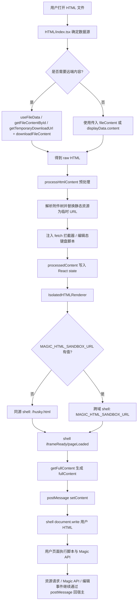
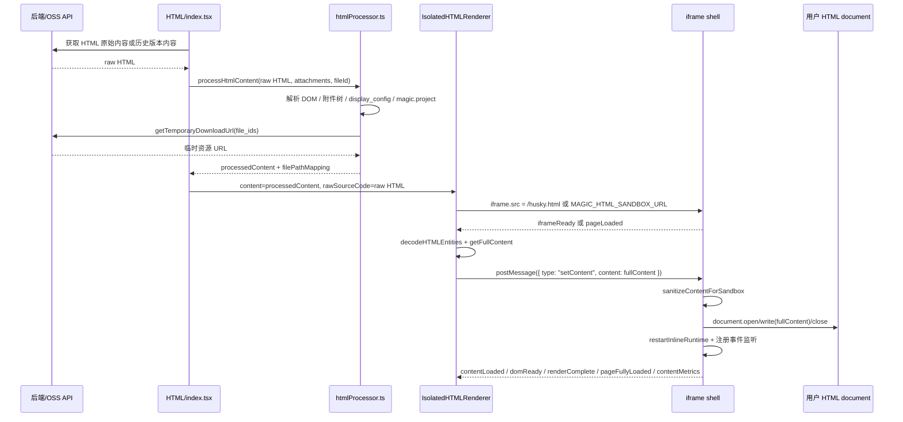
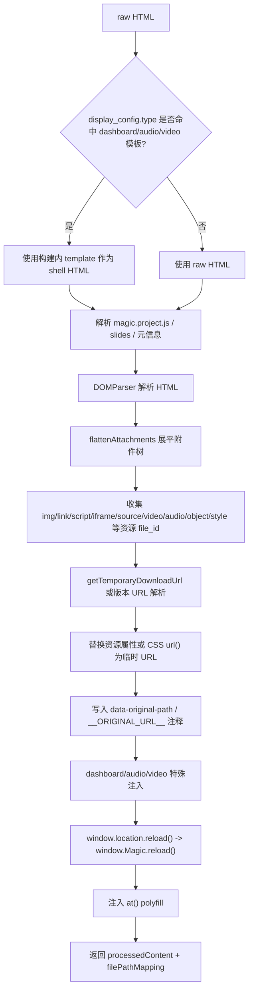
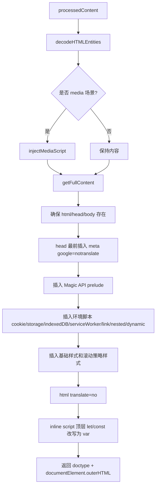
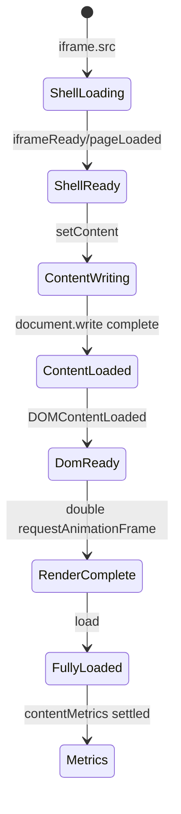
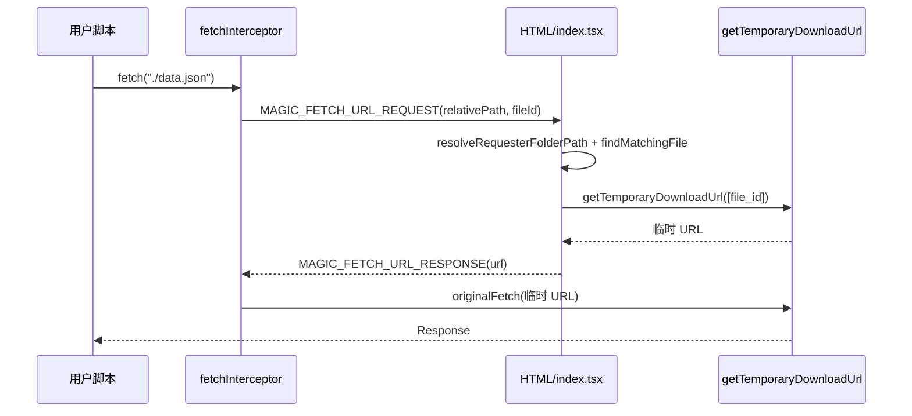
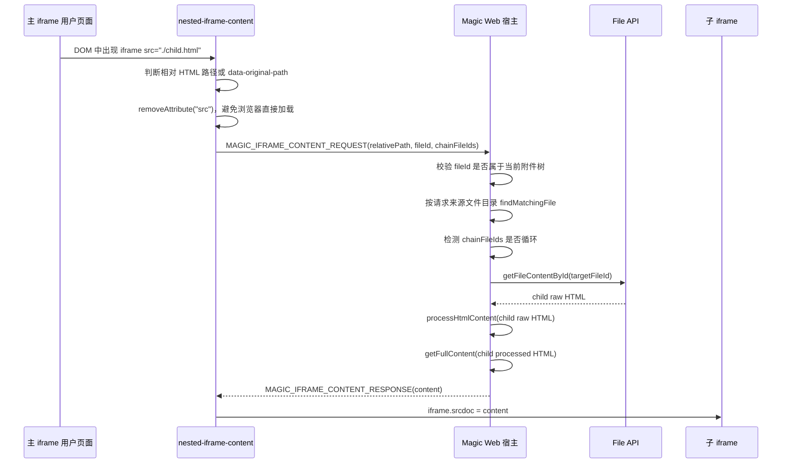
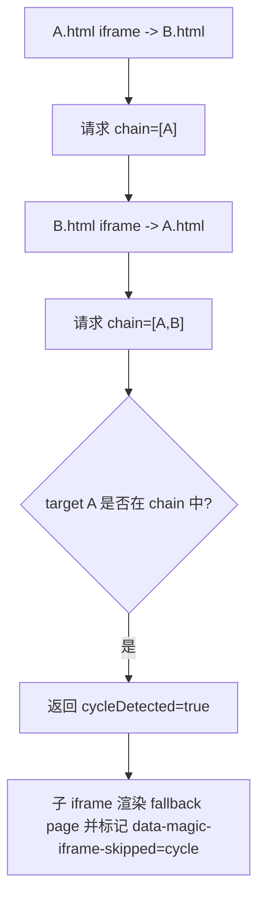
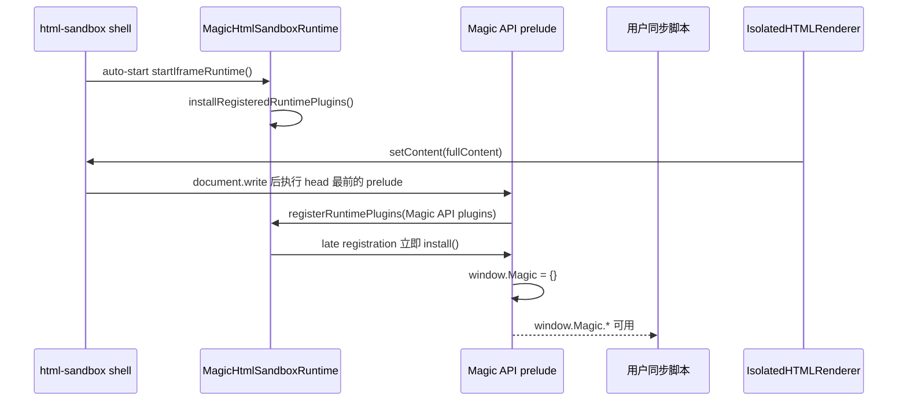
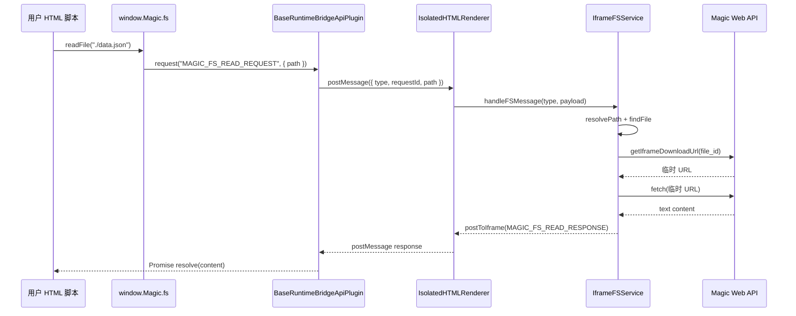

# HTML iframe 业务流转与运行时规范

本文档是 `superMagic` HTML 预览/编辑链路的根说明，用于后续 agent 理解业务流程、定位问题和延续迭代。重点覆盖：

- 同源 iframe 与跨域 iframe 的流转差异。
- HTML 内容从 API 获取到 iframe 渲染的完整处理链路。
- 相对路径静态资源、动态资源、嵌套 iframe 的解析方式。
- `window.Magic.*` 运行时 API 的注入、消息转发和宿主侧执行边界。

## 1. 术语与边界

| 术语 | 含义 |
| --- | --- |
| 宿主 / Parent | Magic Web React 应用，主要入口是 `HTML/index.tsx` 和 `IsolatedHTMLRenderer.tsx`。 |
| 主 iframe | `IsolatedHTMLRenderer` 渲染出的顶层预览 iframe。 |
| shell / 信使壳 | iframe 的初始页面。默认同源 `/husky.html`，或跨域 `MAGIC_HTML_SANDBOX_URL`。来源是 `packages/html-sandbox/index.html`。 |
| 用户 HTML | 后端返回或历史版本下载得到的 HTML 正文，不直接作为 iframe `srcdoc` 写入，而是通过 shell 的 `setContent` 消息写入。 |
| 资源附件树 | 当前 topic/project 的 `attachmentList`，包含 `file_id`、`relative_file_path`、`file_name`、`updated_at` 等信息。 |
| Magic API | 注入到用户 HTML 中的 `window.Magic.*` 能力，iframe 侧只发 `postMessage`，实际副作用由宿主执行。 |

当前检查结果：`enterprise/` 下没有 `pages/superMagic/components/Detail/contents/HTML` 对应 overlay，HTML iframe 链路当前只在开源侧实现。

## 2. 关键文件索引

| 文件 | 职责 |
| --- | --- |
| `src/pages/superMagic/components/Detail/contents/HTML/index.tsx` | HTML 预览入口；获取/接收原始内容，注册父级消息处理器，调用 `processHtmlContent`。 |
| `src/pages/superMagic/components/Detail/contents/HTML/IsolatedHTMLRenderer.tsx` | 主 iframe 组件；选择同源/跨域 shell，等待 ready，调用 `getFullContent`，发送 `setContent`。 |
| `src/pages/superMagic/components/Detail/contents/HTML/htmlProcessor.ts` | 渲染前 HTML 处理；解析附件资源、获取临时下载 URL、写入 `data-original-path`。 |
| `src/pages/superMagic/components/Detail/contents/HTML/utils/full-content.ts` | 最终注入层；插入 Magic API prelude、cookie/storage/mock、链接、嵌套 iframe、动态资源拦截脚本。 |
| `src/pages/superMagic/components/Detail/contents/HTML/utils/fetchInterceptor.ts` | iframe 内 fetch/XHR 相对路径解析，以及宿主侧 `MAGIC_FETCH_URL_*` 处理。 |
| `src/pages/superMagic/components/Detail/contents/HTML/utils/nested-iframe-content.ts` | 相对 HTML 嵌套 iframe 的 `srcdoc` 递归处理。 |
| `src/pages/superMagic/components/Detail/contents/HTML/iframe-api/*` | `window.Magic.*` 的 iframe 侧 API、消息类型、宿主侧 service/hook。 |
| `packages/html-sandbox/index.html` | shell 页面；接收 `setContent` 后 `document.open/write/close`。 |
| `packages/html-sandbox/src/*` | iframe 编辑 runtime、插件注册、桥接基类。 |

## 3. 总体业务流程图



## 4. 同源 iframe 与跨域 iframe

两种模式共用一套 shell 和内容注入机制，差异只在 shell URL、消息目标选择和安全隔离强度。

| 维度 | 同源 iframe | 跨域 iframe |
| --- | --- | --- |
| 开关 | `MAGIC_HTML_SANDBOX_URL` 为空 | `MAGIC_HTML_SANDBOX_URL` 有值 |
| iframe `src` | `/husky.html` | 外部 render-site URL |
| shell 来源 | `packages/html-sandbox/index.html` 构建产物 | 同一套 `packages/html-sandbox/index.html` 部署到外站 |
| `postMessageTargetStrategy` | `SAME_ORIGIN_ANCESTOR` | `CROSS_ORIGIN_PARENT` |
| 资源请求目标 | 沿 parent 链找最后一个同源祖先，避免发到第三方顶层窗口 | 遇到首个跨域父窗口就发出，确保跨域 render-site 能回到 Magic Web |
| 安全隔离 | iframe sandbox 仍包含 `allow-same-origin`，与主站同源时不能作为硬隔离 | 不同 origin 才能隔离主站 cookie/storage/DOM |
| 生命周期校验 | 主要依赖 `event.source === iframe.contentWindow` | 生命周期兜底消息还会校验 `event.origin === externalRenderSiteOrigin` |

主 iframe 的 sandbox 属性为：

```html
sandbox="allow-scripts allow-modals allow-forms allow-same-origin allow-popups allow-downloads allow-pointer-lock allow-orientation-lock allow-presentation"
allow="fullscreen; autoplay; picture-in-picture; encrypted-media; web-share; clipboard-write"
```

规范要求：不能把同源 `/husky.html` 当作安全隔离方案。涉及非可信 HTML、cookie/storage 隔离或更强安全边界时，应配置跨域 `MAGIC_HTML_SANDBOX_URL`。

## 5. API 内容到 iframe 渲染时序图



## 6. `processHtmlContent` 渲染前处理规则

`processHtmlContent` 是 API 原始 HTML 到可预览 HTML 的第一层处理。

### 6.1 输入来源

常见来源包括：

| 来源 | 说明 |
| --- | --- |
| `useFileData` | 根据 `displayData.file_id` 拉取当前文件内容。 |
| `getFileContentById` | 编辑冲突检测、嵌套 iframe 子文件读取等场景。 |
| `getTemporaryDownloadUrl + downloadFileContent` | 历史版本对比等按版本读取场景。 |
| 组件入参 `fileContent` | 外部已提供内容时可作为输入。 |

`rawSourceCode` 会保留给 DevConsole / Sources 面板，`processedContent` 才进入 iframe 渲染。

### 6.2 处理步骤



### 6.3 静态资源替换

处理器会从附件树中解析相对路径资源，批量换成 OSS 临时下载 URL。关键规则：

| 资源形态 | 处理方式 |
| --- | --- |
| `img[src]`、`script[src]`、`iframe[src]`、`source[src]`、`video[src]`、`audio[src]` | 匹配附件后替换为临时 URL，并在元素上写 `data-original-path`。 |
| `link[rel="stylesheet"][href]` | 匹配 CSS 文件后替换 href，并写 `data-original-path`。 |
| CSS `url(...)` 与内联 `style="...url(...)"` | 替换为临时 URL，并用 `/*__ORIGINAL_URL__:path__*/` 保存原路径。 |
| dashboard 数据源 | 可生成 `magicProjectJSConfig` 并调用页面内 `window.magicProjectConfigure(...)`。 |
| audio/video | 注入 media 拦截器，使用预加载 URL 映射。 |

替换时保留原始路径是保存还原和嵌套 iframe 继续识别的基础，后续改动不能删除 `data-original-path` 或 `__ORIGINAL_URL__`。

### 6.4 模板壳

`html-preview-bundled-shell.ts` 会对 `display_config.type` 为 `dashboard`、`audio`、`video` 且入口匹配 `index.html` 的文件使用构建内模板：

| 类型 | 行为 |
| --- | --- |
| `dashboard` | 使用内置 `templates/dashboard/index.html`，并将 `index.css`、`dashboard.js` 内联为当前构建产物。 |
| `audio` / `video` | 使用内置 audio/video 入口 HTML，但数据资源仍走附件和临时 URL。 |

这类模板替换只影响预览壳，不改变后端原始文件内容。

## 7. `getFullContent` 最终注入规则

`IsolatedHTMLRenderer.refreshIframeContent()` 会在 shell ready 后调用 `getFullContent`。这一步生成真正发送给 shell 的 `fullContent`。

注入顺序很关键：



### 7.1 为什么 Magic API prelude 必须靠前

用户 HTML 中的同步脚本可能在 head 内立即调用 `window.Magic.*`。因此 `getFullContent` 会把 `data-injected="magic-api"` 的 prelude 插到业务脚本之前。后续 agent 不能把 Magic API prelude 移到 body 末尾，否则会产生用户脚本抢先执行的竞态。

### 7.2 环境脚本包含内容

| 脚本 | 目的 |
| --- | --- |
| `window.__MAGIC_INITIAL_LANG__` | 给 `MagicI18nApi` 提供初始语言。 |
| `window.__MAGIC_POST_MESSAGE_TARGET_STRATEGY__` | 同源/跨域消息目标策略。 |
| cookie mock | 尽量隔离或兜底 `document.cookie`。 |
| storage mock | 以 `MAGIC:iframe:storage:{markerId}` 隔离 iframe localStorage/sessionStorage 数据。 |
| IndexedDB mock | 在部分 WebView 场景下提供模拟实现。 |
| ServiceWorker mock | 在钉钉/企业微信/飞书等 WebView 中按需兜底。 |
| DOMContentLoaded script | 图片错误占位、链接 target、错误上报、DOM_CLICK 桥接。 |
| link handling script | 拦截相对链接和 `window.open`，通过 `linkClicked` 回宿主。 |
| nested iframe interceptor | 相对 HTML iframe 的递归 `srcdoc` 处理。 |
| dynamic resource interceptor | 动态插入的相对资源 URL 解析。 |

## 8. shell 写入与生命周期

shell 的职责不是展示业务页面，而是作为可复用的信使壳。



`packages/html-sandbox/index.html` 收到 `{ type: "setContent" }` 后会：

1. 清理用户内容中残留的 `slide-bridge`、`data-runtime`、`magic-iframe-runtime-inline` 相关脚本，避免重复 runtime。
2. 执行 `document.open()`、`document.write(fullContent)`、`document.close()`。
3. 调用 `restartInlineRuntime()`，重新启动内联的 `MagicHtmlSandboxRuntime`。
4. 重新注册 message、click、keyboard、error、DOM load 监听。
5. 向宿主发送 `contentLoaded`，随后发送 `domReady`、`renderComplete`、`pageFullyLoaded`、`contentMetrics`。

## 9. 相对路径资源解析

项目中相对路径资源有三层解析机制，三者互补。

### 9.1 渲染前静态解析

`processHtmlContent` 在宿主侧解析初始 HTML 中已存在的资源，优先把它们替换成临时下载 URL。这能让浏览器在首次解析文档时直接加载可访问资源。

路径基准：

- 主 HTML 使用当前文件所在目录。
- `html_relative_path` 存在时优先使用该目录，典型场景是 PPT 或嵌套 iframe。
- 附件匹配基于 `relative_file_path` 和 `file_name`。

### 9.2 fetch/XHR 运行时解析

`injectFetchInterceptorScript` 会覆盖 iframe 内的 `window.fetch` 和 `XMLHttpRequest`：



父级处理器由 `HTML/index.tsx` 注册，核心是 `createParentMessageHandler`。它允许当前文件和附件树内嵌套文件发起请求，避免深层 iframe 的 `fileId` 被误过滤。

### 9.3 动态 DOM 资源解析

`getFullContent` 注入的 dynamic resource interceptor 覆盖资源属性写入和 DOM 变化：

| 覆盖点 | 资源 |
| --- | --- |
| 属性 setter | `script.src`、`img.src`、`iframe.src`、`video.src`、`audio.src`、`link.href`、`object.data`、`video.poster` 等。 |
| `Element.prototype.setAttribute` | 动态 `setAttribute("src" / "href" / "data" / "poster" / "srcset")`。 |
| `MutationObserver` | `innerHTML`、DOM 插入、属性变化等后置场景。 |
| style 处理 | `style` 属性、`style` 标签、`srcset` / `imagesrcset`。 |

相对 HTML iframe 是例外：如果 `iframe[src]` 指向相对 `.html/.htm`，dynamic resource interceptor 会跳过，交给 nested iframe interceptor 处理，避免提前替换成 OSS URL 后失去递归注入能力。

## 10. 嵌套 iframe 解析

嵌套 iframe 专门处理 `<iframe src="./child.html">` 这类相对 HTML 文件。目标是让子页面也经过同样的资源替换和 Magic API 注入，而不是直接加载原始 OSS HTML。



### 10.1 递归和循环

子页面的 `fullContent` 中也会注入 nested iframe interceptor，因此支持多层嵌套。

循环通过 `chainFileIds` 检测：



### 10.2 未找到与超时

- 未找到目标文件时返回 `skipProcessing=true`、`skipReason="not-found"`，iframe 渲染轻量 fallback page。
- 15 秒未收到响应时，脚本会恢复原始 `src`，至少让浏览器尝试原始加载。

### 10.3 保存还原

编辑保存链路必须清理运行时痕迹：

| 运行时痕迹 | 保存时要求 |
| --- | --- |
| `data-injected` 脚本和样式 | 删除。 |
| `data-original-path` | 用于恢复 `src` / `href` / `data`。 |
| 嵌套 iframe 的 `srcdoc` | 删除，恢复为原始 `src`。 |
| `/*__ORIGINAL_URL__*/` | 恢复 CSS 原始相对路径。 |

相关清理入口在 `utils/index.ts`、`utils/editing-script.ts`、`hooks/useHTMLEditorV2.ts`。

## 11. Magic API 注入与运行时转发

Magic API 是 iframe 页面访问宿主能力的唯一业务入口。原则是：iframe 注入方法，宿主执行能力，敏感凭据不出宿主内存。

### 11.1 注入时序



`prelude-entry.ts`（经 `virtual:magic-api` 编译注入）会检查 `window.MagicHtmlSandboxRuntime.registerRuntimePlugins` 和 `BaseRuntimeBridgeApiPlugin` 是否存在。若 runtime 未就绪，会向父窗口发送 `MAGIC_API_PRELUDE_ERROR`。

### 11.2 iframe 侧 API

| API | iframe 侧能力 | 宿主侧处理 |
| --- | --- | --- |
| `window.Magic.fs.readFile(path)` | 读取工作区文本文件 | `IframeFSService` 获取临时 URL 后 fetch 文本。 |
| `window.Magic.fs.writeFile(path, content)` | 写入文本、Blob、ArrayBuffer | 已存在文件走 `saveIframeFileContent`，不存在文件走上传创建。 |
| `window.Magic.fs.listFiles(dir)` | 列举应用根目录内文件 | `IframeFSService` 从附件树过滤。 |
| `window.Magic.fs.watchFile(path, callback)` | 监听文件 `updated_at` 变化 | 宿主 3 秒轮询附件快照并推送 `MAGIC_FS_FILE_CHANGED`。 |
| `window.Magic.getAppBasePath()` | 获取应用根路径 | 从入口文件 `entryPath` 派生。 |
| `window.Magic.llm.getModels()` | 获取模型列表 | `IframeLLMService` 通过宿主授权签发 model gateway token。 |
| `window.Magic.llm.chat()` | 一次性聊天 | 宿主调用 `/v1/chat/completions`。 |
| `window.Magic.llm.stream()` | 流式聊天 | 宿主转发 stream chunk，可 abort。 |
| `window.Magic.reload()` | 刷新当前 HTML | 发送 `MAGIC_RELOAD_REQUEST`，宿主触发详情刷新。 |
| `window.Magic.setInputMessage(message)` | 设置聊天输入框文本 | 发送 `MAGIC_SET_INPUT_MESSAGE`。 |
| `window.Magic.i18n.subscribe(callback)` | 订阅语言变化 | 宿主发送当前语言和后续 `languageChanged`。 |
| `window.Magic.project.uploadFiles(files)` | 上传浏览器 File 到 workspace | `useMagicFiles` 走现有上传链路。 |
| `window.Magic.project.addFilesToMessage(paths)` | 将 workspace 文件加入消息输入 | `useMagicFiles` 查附件并调用 topic 相关逻辑。 |
| `window.Magic.project.downloadFiles(paths)` | 触发浏览器下载 workspace 文件 | `useMagicFiles` 获取临时下载 URL。 |
| `window.Magic.agent.getAgents()` | 获取当前 Agent 列表 | `IframeAgentService` 返回宿主列表。 |
| `window.Magic.project.createTopicAndSend()` | 新建话题并发送 | `IframeAgentService`，受 `enableWriteOperations` 控制。 |
| `window.Magic.project.sendMessage()` | 当前话题发送消息 | `IframeAgentService`，受 `enableWriteOperations` 控制。 |

部分旧 API 仍保留根级别别名，例如 `window.Magic.uploadFiles`、`window.Magic.getAgents`，但新代码应使用命名空间 API。

### 11.3 Magic API 消息时序



### 11.4 安全与权限边界

| 边界 | 规则 |
| --- | --- |
| Token | LLM `api_key` / `refresh_token` 只存在 `IframeLLMService` 内存中，不能通过 postMessage 返回给 iframe。 |
| 文件路径 | FS 路径必须在应用根目录或 `app.json.files` alias 允许范围内解析。 |
| 文件大小 | 文本读写限制约 5 MB，Blob 写入限制约 500 MB。 |
| Agent 写操作 | `createTopicAndSend`、`sendMessage` 必须显式开启 `enableWriteOperations`。当前主渲染器开启为 `true`。 |
| 消息白名单 | `IsolatedHTMLRenderer` 只处理允许的旧协议消息；`version:"1.0.0"` 的编辑协议交给 `MessageBridge`。 |
| 跨域源校验 | 跨域 shell 生命周期兜底消息必须匹配 `externalRenderSiteOrigin`。 |

## 12. postMessage 协议分层

| 分层 | 消息 | 方向 |
| --- | --- | --- |
| shell 生命周期 | `iframeReady`、`pageLoaded`、`contentLoaded`、`domReady`、`renderComplete`、`pageFullyLoaded`、`contentMetrics`、`MAGIC_HTML_SANDBOX_TELEMETRY` | iframe -> 宿主 |
| 内容控制 | `setContent`、`setAnimationState`、`editModeChange`、`activateEditorRuntime` | 宿主 -> iframe |
| 相对资源 | `MAGIC_FETCH_URL_REQUEST` / `MAGIC_FETCH_URL_RESPONSE` | 双向 |
| 嵌套 iframe | `MAGIC_IFRAME_CONTENT_REQUEST` / `MAGIC_IFRAME_CONTENT_RESPONSE` | 双向 |
| Magic FS | `MAGIC_FS_*` | 双向 |
| Magic LLM | `MAGIC_LLM_*` | 双向 |
| Magic workspace | `MAGIC_UPLOAD_FILES_*`、`MAGIC_ADD_FILES_TO_MESSAGE_*`、`MAGIC_DOWNLOAD_FILES_*` | 双向 |
| Magic agent/project | `MAGIC_GET_AGENTS_*`、`MAGIC_CREATE_TOPIC_AND_SEND_*`、`MAGIC_SEND_MESSAGE_*` | 双向 |
| 编辑 V2 | `version:"1.0.0"` 的 request/response/event/command | 双向 |

## 13. 后续迭代规范

### 13.1 新增资源类型

新增一种相对资源属性时，需要同步修改：

1. `htmlProcessor.ts` 的渲染前收集和替换。
2. `full-content.ts` 的 dynamic resource interceptor。
3. 保存清理还原逻辑，确保不把临时 URL 或 `srcdoc` 落盘。
4. 相关测试与本文档。

### 13.2 新增 Magic API

iframe 注入的 Magic API 由唯一 TS 源 `iframe-api/magic-api/*.ts` 定义。构建期
通过 Vite 虚拟模块 `virtual:magic-api`（见 `plugins/vite-plugin-magic-api.ts`）
将 `prelude-entry.ts` 编译为自包含 IIFE 字符串，`full-content.ts` 直接以
`import magicApiPreludeScript from "virtual:magic-api"` 消费并注入 `<head>`。
磁盘上不存在手写字符串副本或中间态文件。

新增 `window.Magic.*` API 时，需要同步修改：

1. 在 `iframe-api/magic-api/` 下新增对应 TS runtime plugin（继承 `BaseRuntimeBridgeApiPlugin`）。
2. 将新插件类添加到 `index.ts` 的 `magicApiPlugins` 数组。
3. `iframe-api/types/index.ts` 中的消息类型和 payload 类型。
4. 宿主侧 service/hook。
5. `IsolatedHTMLRenderer` 消息白名单和分发逻辑。
6. 权限边界、超时、错误响应和测试。
7. `packages/html-sandbox/src/index.ts` 中 `Window.Magic` 类型声明。

### 13.3 修改同源/跨域策略

必须同时检查：

1. `IsolatedHTMLRenderer` 中 `htmlSandboxShellUrl`、`externalRenderSiteOrigin`、`postMessageTargetStrategy`。
2. `fetchInterceptor.ts` 的 `MAGIC_FETCH_POST_MESSAGE_TARGET_HELPER`。
3. `full-content.ts` 注入的 `window.__MAGIC_POST_MESSAGE_TARGET_STRATEGY__`。
4. `nested-iframe-content.ts` 的请求目标。
5. 父级 `postMessage` 的 `targetOrigin` 与消息来源校验。

### 13.4 修改 shell 写入机制

不能绕过 shell 直接设置主 iframe `srcdoc`，除非同时重写：

1. runtime auto-start 和 `MagicHtmlSandboxRuntime` 重启机制。
2. `setContent` 后生命周期消息。
3. 同源/跨域统一路径。
4. 编辑 runtime 重新注入逻辑。

当前业务假设是：iframe 先加载 shell，再通过 `setContent` 写入用户 HTML。

## 14. 常见问题排查

| 问题 | 排查路径 |
| --- | --- |
| 页面空白 | 看 shell 是否发 `iframeReady/pageLoaded`，再看 `setContent` 是否发送，最后看 `stage=iframe_failure` 及 `failureType`。 |
| 图片或脚本 404 | 看元素是否有 `data-original-path`，父级是否收到 `MAGIC_FETCH_URL_REQUEST`，`findMatchingFile` 是否按正确目录解析。 |
| 嵌套 iframe 空白 | 看是否发送 `MAGIC_IFRAME_CONTENT_REQUEST`，响应是否 `not-found` 或 `cycleDetected`。 |
| Magic API 不存在 | 看 head 最前是否有 `data-injected="magic-api"`，是否收到 `MAGIC_API_PRELUDE_ERROR`。 |
| 编辑保存污染原文件 | 检查保存结果是否残留 `data-injected`、临时 URL、`srcdoc`、`data-magic-iframe-*`。 |
| 跨域模式资源解析失败 | 检查 `MAGIC_HTML_SANDBOX_URL` origin、`CROSS_ORIGIN_PARENT` 策略和父级消息 origin/source 判断。 |

## 15. 最小回归清单

每次改动 iframe 链路，至少覆盖以下场景：

1. 同源 `/husky.html` 渲染普通 HTML。
2. 跨域 `MAGIC_HTML_SANDBOX_URL` 渲染普通 HTML。
3. 初始静态资源：`img`、`script`、`link stylesheet`、CSS `url(...)` 能加载。
4. 动态资源：运行时 `fetch("./data.json")`、动态插入 `img.src = "./a.png"` 能解析。
5. 单层嵌套 iframe：`<iframe src="./child.html">` 使用 `srcdoc` 渲染。
6. 多层嵌套 iframe：A -> B -> C 能按各自目录解析资源。
7. 循环嵌套：A -> B -> A 返回 fallback，不无限递归。
8. `window.Magic.fs.readFile/writeFile/listFiles/watchFile` 正常返回。
9. `window.Magic.llm` 不泄露 token，错误响应能回到 iframe。
10. 编辑保存后不落盘临时 URL、注入脚本、`srcdoc`。
