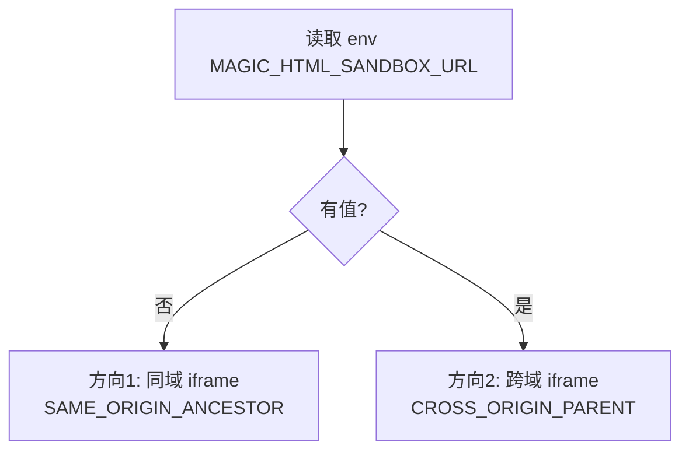
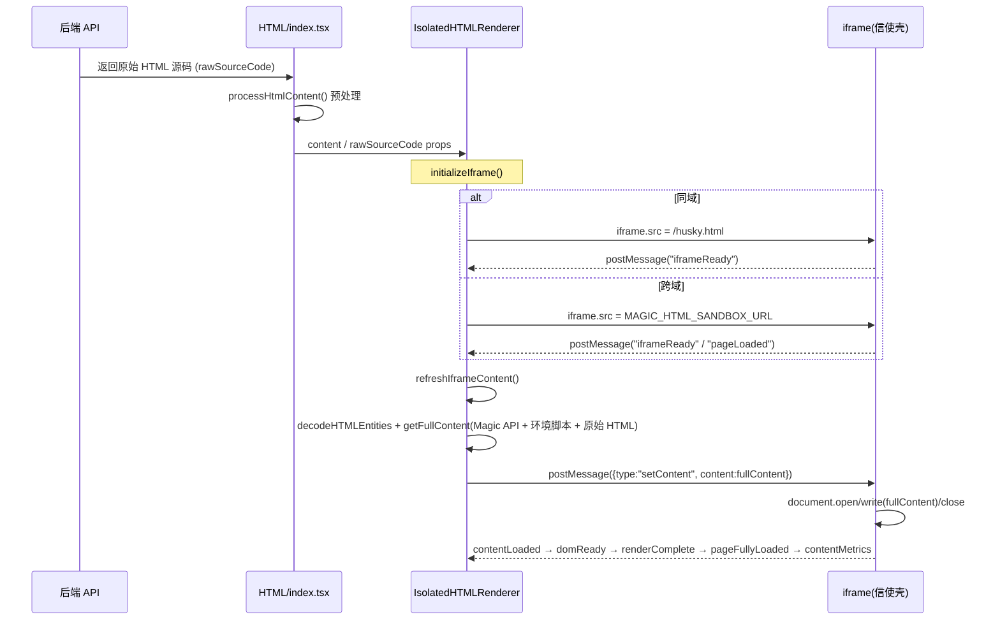
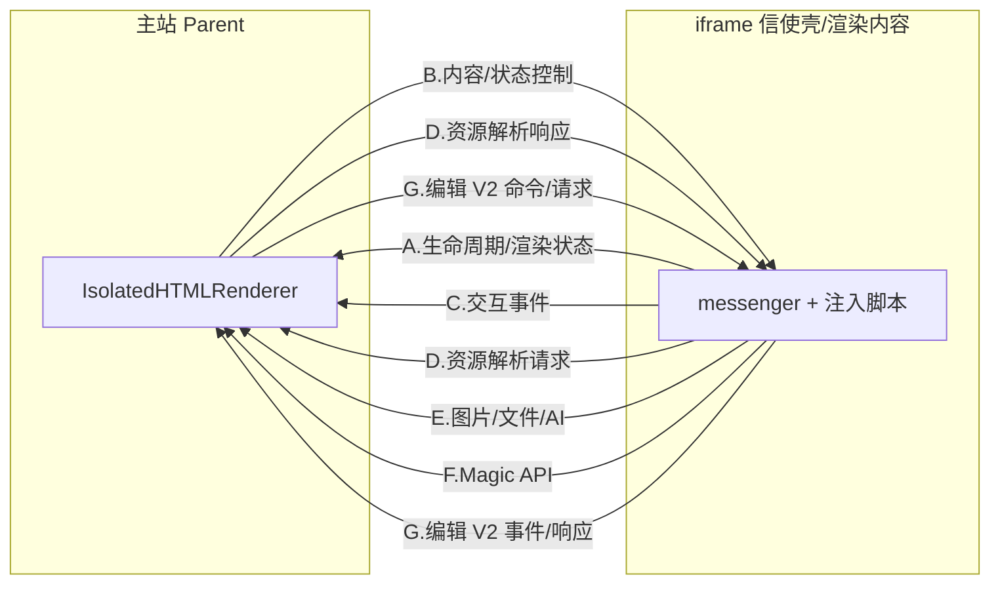
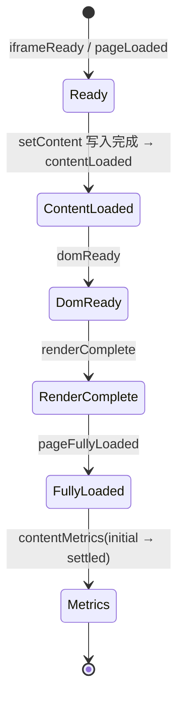

# HTML 预览 iframe 渲染流程梳理

本文梳理 `superMagic` Detail 模块中 HTML 预览/编辑能力的渲染流程，覆盖同源 `/husky.html` 与跨域 `MAGIC_HTML_SANDBOX_URL` 两种 shell 加载方向、从 API 取数到写入 iframe 的全过程、写入后与主站的交互、以及涉及的状态值与枚举。

## 1. 整体定位与两种方向

核心组件为 [IsolatedHTMLRenderer.tsx](../IsolatedHTMLRenderer.tsx)，入口由 [contents/HTML/index.tsx](../index.tsx) 调起。两种方向通过环境变量 `MAGIC_HTML_SANDBOX_URL` 切换。

- **方向 1（同源 shell）**：`MAGIC_HTML_SANDBOX_URL` 为空，iframe 的 `src` 固定为 `/husky.html`，`postMessageTargetStrategy = SAME_ORIGIN_ANCESTOR`。`/husky.html` 是 `packages/html-sandbox/index.html` 在 Magic Web dev/build 阶段生成到 `public/` 的产物，并内联打开即执行的 runtime core。
- **方向 2（跨域 shell）**：iframe 的 `src` 指向另一个站点（`MAGIC_HTML_SANDBOX_URL`，如 `https://husky.pages.letsmagic.space/index.html`），策略改为 `CROSS_ORIGIN_PARENT`。该渲染站使用同一套 `packages/html-sandbox/index.html` shell。

> **关键点**：两个方向写入内容的机制统一为 `iframe.src` 加载 shell，再通过 `postMessage({type:"setContent"})` 把真正的 HTML 交给 shell，由 **shell 在自己的文档里执行 `document.open()/write()/close()`** 完成渲染。差别仅在于 shell 的 URL 是同源 `/husky.html` 还是跨域 `MAGIC_HTML_SANDBOX_URL`。

> **安全边界**：`/husky.html` 统一的是流程，不提供跨域安全隔离；它仍与 Magic Web 同源。需要跨域隔离时仍必须配置不同 origin 的 `MAGIC_HTML_SANDBOX_URL`。

### 为什么需要跨域方案

让被渲染的第三方/用户 HTML 不与主站共享同源，从而**无法直接读写主站的 `localStorage / sessionStorage / cookie` 与 DOM**，安全边界更硬；内部还对 cookie/storage 做了 mock 隔离（`utils/full-content.ts`）。`/husky.html` 只作为同源 shell 兼容链路，不替代跨域方案。

## 2. 从 API 取数到写入 iframe 的完整流程

分阶段说明：

1. **取数**：API 返回原始 HTML，经 `htmlProcessor.ts` 的 `processHtmlContent`（CDN 改写、模板识别等）处理，同时保留 `rawSourceCode` 供 DevConsole 展示。特殊场景（dashboard / audio / video）会用构建内模板替换（`html-preview-bundled-shell.ts`）。
2. **建壳 `initializeIframe()`**：无论同源还是跨域都设置 iframe `src`。同源加载 `/husky.html`，跨域加载 `MAGIC_HTML_SANDBOX_URL`，等待 shell 回报 `iframeReady` 或可信 `pageLoaded`。
3. **内容注入 `refreshIframeContent()`**：先 `decodeHTMLEntities`，必要时注入 media 脚本，再用 `getFullContent()` 把 Magic API prelude、环境脚本（fetch 拦截、cookie/storage mock、点击/键盘桥接、错误上报、内容尺寸计算、postMessage 目标策略等）插到目标 HTML 原始脚本之前，最后 `postMessage("setContent")` 发给 shell。runtime core 在 shell 打开时已经启动，Magic API prelude 会在新 document 中调用 runtime registry 完成按内容安装。
4. **真正渲染**：shell 收到 `setContent` 后在自己文档里 `document.open/write/close` 完成渲染，并依次回报生命周期消息。

## 3. 写入 iframe 后与主站的交互

交互全部走 `postMessage`（消息白名单见 `IsolatedHTMLRenderer.tsx` 的 `iframeMessageTypes`，新协议另由 `iframe-bridge/bridge/MessageBridge.ts` 处理）。

| 分类                             | 方向          | 主要消息                                                                                                                                                                                                           |
| -------------------------------- | ------------- | ------------------------------------------------------------------------------------------------------------------------------------------------------------------------------------------------------------------ |
| A. 生命周期/渲染状态             | iframe → 主站 | `iframeReady`、`pageLoaded`、`contentLoaded`、`domReady`、`renderComplete`、`pageFullyLoaded`、`contentMetrics`、`MAGIC_HTML_SANDBOX_TELEMETRY`                                                                    |
| B. 内容/状态控制                 | 主站 → iframe | `setContent`、`setAnimationState`、`editModeChange`、`activateEditorRuntime`、`MAGIC_I18N_LANG_SUBSCRIBE`                                                                                                          |
| C. 交互事件                      | iframe → 主站 | `linkClicked`、`DOM_CLICK` / `documentClicked`、`keyboardEvent`                                                                                                                                                    |
| D. 资源解析                      | 双向          | `MAGIC_FETCH_URL_REQUEST/RESPONSE`、`MAGIC_MEDIA_IMAGE_URL_REQUEST/RESPONSE`                                                                                                                                       |
| E. 图片/文件/AI                  | 双向          | `REQUEST_IMAGE_UPLOAD` + `IMAGE_UPLOAD_RESULT`、`DOWNLOAD_IMAGE`、`AI_OPTIMIZATION_ACTION`、`saveContent`                                                                                                          |
| F. Magic API（`window.Magic.*`） | 双向          | `MAGIC_RELOAD_REQUEST`、`MAGIC_SET_INPUT_MESSAGE`、`MAGIC_UPLOAD_FILES_*`、`MAGIC_ADD_FILES_TO_MESSAGE_*`、`MAGIC_DOWNLOAD_FILES_*`、`MAGIC_GET_AGENTS_*`、`MAGIC_CREATE_TOPIC_AND_SEND_*`、`MAGIC_SEND_MESSAGE_*` |
| G. 编辑 V2 协议                  | 双向          | `version:"1.0.0"` 的 `request/response/event/command`                                                                                                                                                              |

> **来源校验**：`handleMessage` 优先用 `event.source === iframe.contentWindow` 校验消息来源；配置了跨域 shell 时再结合 `event.origin === externalRenderSiteOrigin` 校验生命周期兜底消息，避免把同源 `/husky.html` 误判为跨域。

## 4. 状态值与枚举

### 4.1 主站组件本地状态（React state，描述「写入到哪一步」）

| 状态                          | 含义                                                                 |
| ----------------------------- | -------------------------------------------------------------------- |
| `iframeLoaded`                | 信使壳就绪（收到 `iframeReady` / `pageLoaded`），可接收 `setContent` |
| `contentInjected`             | 目标 HTML 已注入；编辑模式下用它触发编辑脚本重注入                   |
| `scalingContentMetrics.phase` | 内容尺寸阶段，枚举 `"initial" \| "settled"`，用于缩放计算时机        |
| `processedSourceCode`         | 最终注入的完整 HTML（供 DevConsole）                                 |

iframe shell 内部还维护 `runtimeState`（`loaded / loading / runtimeUrl`）与 `isEditMode / isAnimationPaused`。Magic Web 主链路默认使用打开即执行的内联 runtime core，旧 runtime URL 加载分支仅作为 sandbox 兼容能力保留。

### 4.2 消息协议枚举（跨 iframe 契约，`iframe-bridge/types/messages.ts`）

- **`MessageCategory`**：
    - `REQUEST` — 请求消息（需要响应）
    - `RESPONSE` — 响应消息
    - `EVENT` — 事件消息（单向通知）
    - `COMMAND` — 命令消息（可撤销操作）
- **`MessageSource`**：`"parent" | "iframe"`
- **`EditorMessageType`**（按域分组）：
    - 样式类：`SET_BACKGROUND_COLOR / SET_TEXT_COLOR / SET_FONT_SIZE / SET_FONT_WEIGHT / BATCH_STYLES / BATCH_STYLES_MULTIPLE / ADJUST_FONT_SIZE_RECURSIVE / SET_ELEMENT_POSITION / DELETE_ELEMENT / DUPLICATE_ELEMENT / RUN_IMAGE_ACTION`
    - 批量操作：`BEGIN_BATCH_OPERATION / END_BATCH_OPERATION / CANCEL_BATCH_OPERATION / APPLY_STYLES_TEMPORARY`
    - 文本内容：`SET_TEXT_CONTENT / GET_TEXT_CONTENT / UPDATE_TEXT_CONTENT / ENABLE_TEXT_EDITING / DISABLE_TEXT_EDITING`
    - 文本样式：`APPLY_TEXT_STYLE / GET_TEXT_SELECTION / GET_TEXT_SELECTION_STYLES / TEXT_SELECTION_CHANGED`
    - 内容操作：`GET_CONTENT / GET_CLEAN_CONTENT / SET_CONTENT / INIT_CONTENT`
    - 编辑状态：`ENTER_EDIT_MODE / EXIT_EDIT_MODE / SELECT_ELEMENT`
    - 选择模式：`ENTER_SELECTION_MODE / EXIT_SELECTION_MODE / CLEAR_SELECTION / GET_COMPUTED_STYLES / REFRESH_SELECTED_ELEMENT(S)`
    - 撤销重做：`UNDO / REDO / GET_HISTORY_STATE / CLEAR_HISTORY`
    - 保存：`SAVE_CONTENT`
    - 验证：`VALIDATE_CONTENT`
    - 系统事件：`IFRAME_READY / CONTENT_CHANGED / HISTORY_STATE_CHANGED / EDIT_MODE_CHANGED / ELEMENT_SELECTED / ELEMENT_DESELECTED / ELEMENTS_SELECTED / ELEMENTS_DESELECTED / ELEMENT_HOVERED / ELEMENT_HOVER_END / SELECTION_MODE_CHANGED / IFRAME_ZOOM_REQUEST`
    - 命令执行：`EXECUTE_COMMAND`

### 4.3 字符串常量枚举（`utils/fetchInterceptor.ts`）

| 枚举                             | 取值                                           | 含义                                                                                     |
| -------------------------------- | ---------------------------------------------- | ---------------------------------------------------------------------------------------- |
| `FETCH_MESSAGE_TYPES`            | `REQUEST` / `RESPONSE`                         | fetch 拦截的相对路径解析请求/响应                                                        |
| `KEYBOARD_MESSAGE_TYPES`         | `SAVE` / `SAVE_AND_EXIT` / `CANCEL` / `SOURCE` | 编辑态键盘快捷键                                                                         |
| `POST_MESSAGE_TARGET_STRATEGIES` | `SAME_ORIGIN_ANCESTOR` / `CROSS_ORIGIN_PARENT` | **区分两种方向的开关**：同域向上找最后一个同源窗口；跨域遇到首个跨域边界即作为目标父窗口 |

### 4.4 生命周期状态机（iframe → 主站）

## 5. 相关文件索引

- 渲染主组件：`IsolatedHTMLRenderer.tsx`
- 入口：`index.tsx`
- 同源 shell 生成产物：`public/husky.html`（由脚本生成，不提交）
- shell 源模板：`packages/html-sandbox/index.html`
- runtime auto-start entry：`packages/html-sandbox/src/auto-start.ts`
- 注入脚本组装（Magic API、cookie/storage mock 等）：`utils/full-content.ts`
- fetch 拦截与策略枚举：`utils/fetchInterceptor.ts`
- HTML 预处理：`htmlProcessor.ts`
- 构建内模板（dashboard/audio/video）：`html-preview-bundled-shell.ts`
- 消息协议类型与枚举：`iframe-bridge/types/messages.ts`
- 新协议桥接：`iframe-bridge/bridge/MessageBridge.ts`
- 同源/跨域 shell 与运行时：`packages/html-sandbox/`
- 通信场景清单：`docs/iframe-communication-scenarios.md`
- 跨域开发流程：`docs/iframe-cross-domain-dev-workflow.md`
